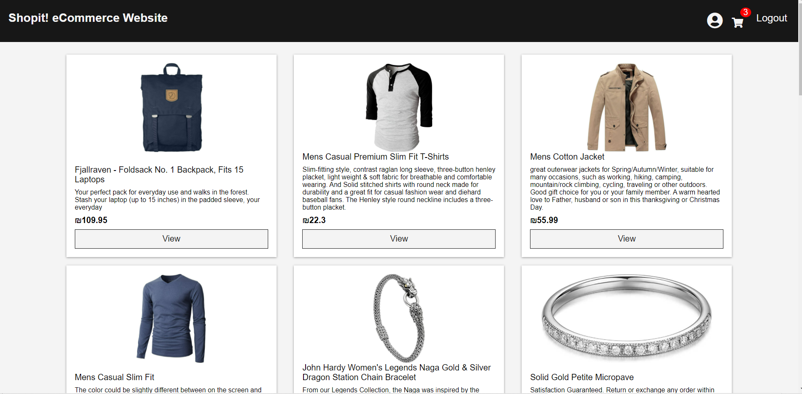

# eCommerce Website

---
### Table of Contents
- [Description](#description)
- [How To Use](#how-to-use)
- [Author Info](#author-info)

---
## Description
An eCommerce website where everyone can shop for anything! 

Special features: User Authentication, Stripe for accepting payments, using a fake store API as my own.
#### Technologies
- Frontend: HTML, Javascript, CSS, React, Redux.
- BackEnd: Nodejs, Express, Mongoose
- Database: MongoDB

[Back To The Top](#eCommerce-Website)

---
## How To Use
1. Clone the repository.
2. Run the command: 'npm run dev' in the terminal from the main directory.

Note: checkout won't work because I didn't publish my private Stripe key which I make use of in checkoutRoutes.js. You can open a Stripe account and get your own private key and use it. [(How to use Stripe)](https://www.youtube.com/watch?v=1r-F3FIONl8&t=1117s)
#### Installation
1. Nodejs - (https://nodejs.org/en/download/current/)
2. MongoDB Community server - (https://www.mongodb.com/try/download/community)
3. Optional (in order to see the DB in your eyes)- MongoDB GUI: MongoDB Compass or Robo 3T - (https://www.mongodb.com/products/compass) or (https://robomongo.org/)

[Back To The Top](#eCommerce-Website)

---
## Author Info

- LinkedIn - [Elad Ayaso](https://www.linkedin.com/in/eladayaso/)

[Back To The Top](#eCommerce-Website)
